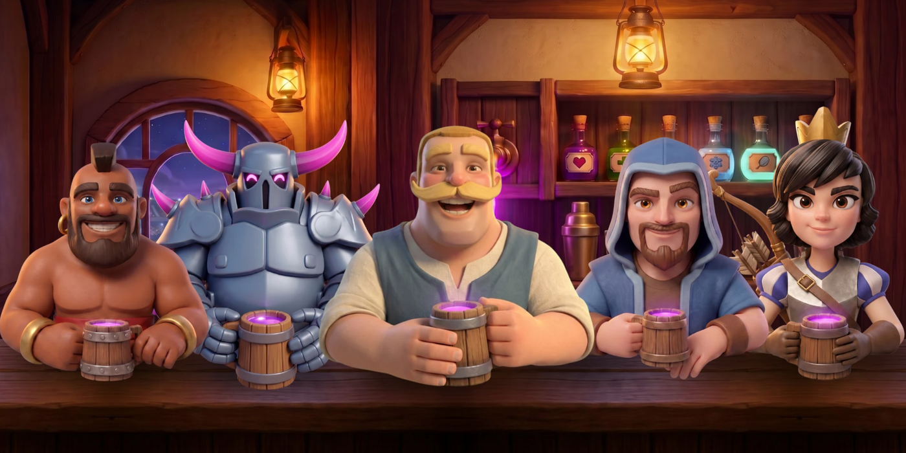
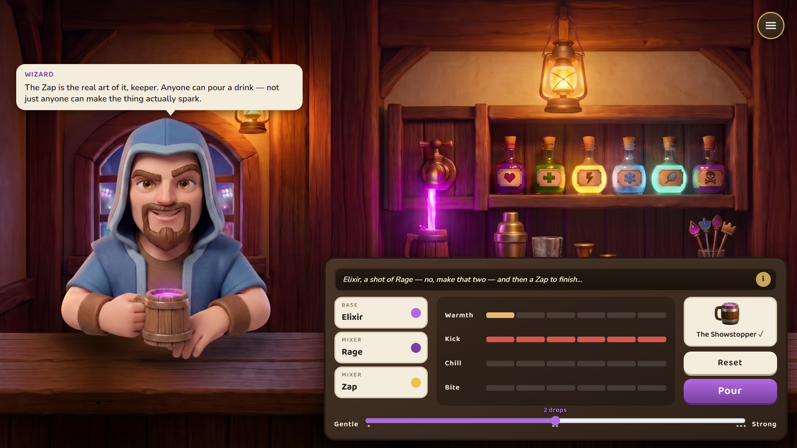
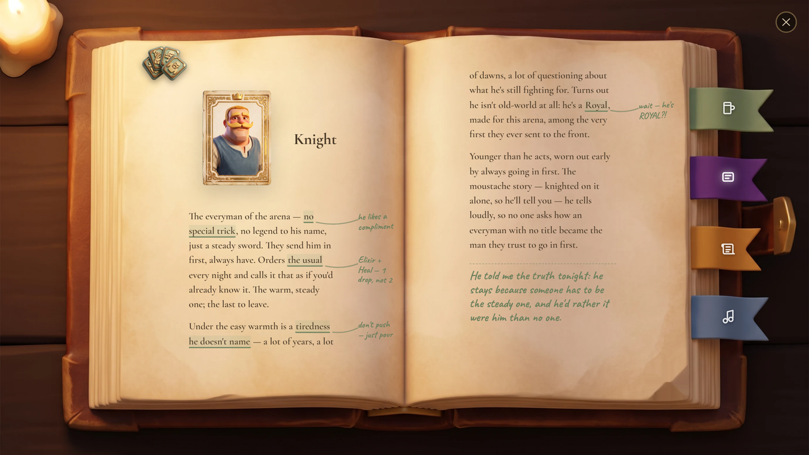
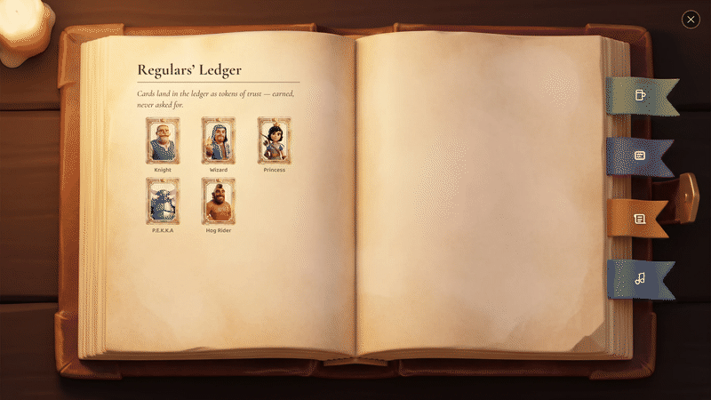
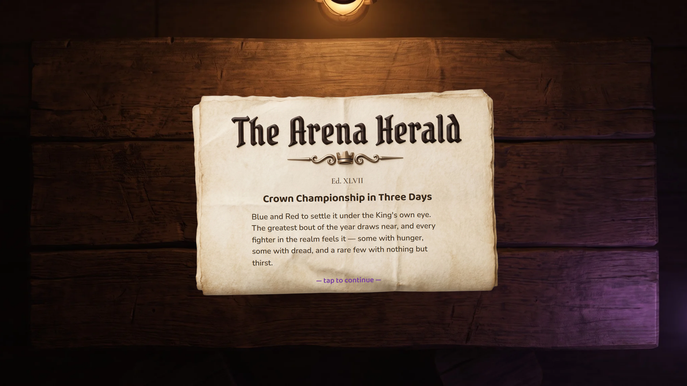
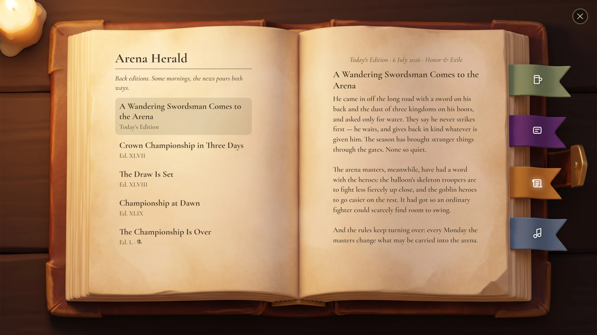
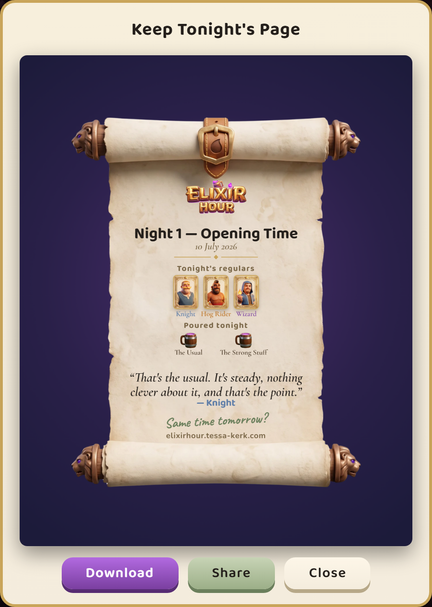
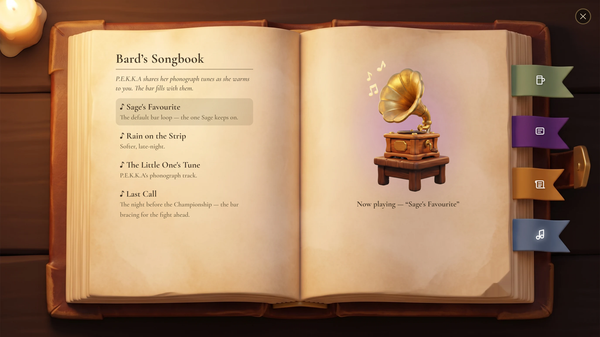

<p align="center">
  
</p>

<h1 align="center">Elixir Hour</h1>

<p align="center">
  <em>Coffee Talk, in the Clash Royale universe — a cosy live-ops companion, built solo with AI in 7 days.</em>
</p>

<p align="center">
  <a href="https://elixirhour.tessa-kerk.com/play/"><strong>▶&nbsp; Play it</strong></a>
  &nbsp;·&nbsp;
  <a href="https://elixirhour.tessa-kerk.com/case-study/"><strong>The case study</strong></a>
  &nbsp;·&nbsp;
  <a href="https://elixirhour.tessa-kerk.com/"><strong>The landing page</strong></a>
</p>

---

## What it is

You play Sage, who keeps the bar on the strip of neutral ground between the kingdoms. The fighters come in after their duels — Knight, Wizard, Princess, P.E.K.K.A, Hog Rider — and none of them want to talk about the fighting.

You read them, you brew, and the conversation opens. Elixir is the base, Clash spells are the mixers, and the drink you hand someone decides how much of themselves they hand back. Pour the cup a person actually needed and they'll tell you something they've told nobody.

Three Nights. Nobody wins. Everyone goes home a little lighter.

---

## The bar

### Serving, and the brewing



A regular sits down and orders in their own words, and their order stays pinned above the mixer while you work. Pick a base, pick your mixers, decide how hard to pour it. Four qualities — Warmth, Kick, Chill, Bite — shift as you build, and when you land on a drink the bar knows, it names itself.

Nothing stops you pouring the wrong thing. The Wizard will drink whatever you put in front of him. He just won't say the thing he was about to say.

### The Tome



Sage's book: every recipe she's been taught, every regular she's met, every edition of the paper, and the songs. The Ledger is the good part. Each regular gets a printed page, and Sage annotates it in green in the margins as she works them out — the notes deepen across the three Nights, so the book fills in as you listen.

It turns like a book, because a book that scrolls isn't a book.



### The Arena Herald



Between Nights, the paper goes up on the counter: an in-world newspaper carrying the realm's news the way a bar would actually hear it. Edition 1 runs four of them, Ed. XLVII through Ed. L, and each one files itself into the Tome the moment it's pinned, so you can go back and read what the bar was worrying about last night.

The last of those four is why the Herald exists at all. **The drink you pour the Knight on the third Night decides what the morning paper says about him.** Serve him right and he comes through his opening bout, to everyone's surprise but his own. Serve him something loud or bitter and he goes out early, off his game — though he's seen laughing about it by nightfall. It is one line of one headline, and it is the whole point: the game remembers the cup. *Coffee Talk* forgets every drink the moment it's served.

### Today's Edition — where the bar meets the live game



Above the four story editions sits a page that reports the **real** Clash Royale, retold as gossip. As I write, that's the wandering swordsman who came in off the long road with the Season of Honor & Exile, and the arena masters having a quiet word with the heroes about crowding everyone else out. Nobody in the bar's world knows what a card is: Ronin is a person who has taken a corner table, and the arena has masters, never a balance team.

It lives in [`data/today.js`](data/today.js), which carries the item and a `validUntil` date. Past that date the game falls through to an evergreen page — undated, and true on any night the bar is open — so a live companion never looks abandoned. That fallthrough is also the failure mode: a missing or malformed date yields the evergreen page rather than a stale headline.

Refreshing it for a new season means rewriting one data file. No code, no schema, no redeploy of anything else. That's the seam the whole format rests on, and it's what the [case study](https://elixirhour.tessa-kerk.com/case-study/) means by a game that can answer a live calendar within a day.

### The Night Cap

<p align="center">
  
</p>

Every Night ends with a page worth keeping: who came in, what you poured them, and the one line from the evening that stuck. Download it, or share it as a link — the card rebuilds itself out of roughly sixty characters in the URL fragment, so there's no server, no database, and nothing to expire.

### Music and sound



Four tracks play behind the bar, and they unlock as the story does. The last one won't even show you its title before you've earned it, because its title is a spoiler. P.E.K.K.A keeps a phonograph where her heart would be, and once she trusts you, she shares it.

---

## How it was made

Built with AI throughout — the writing, the art, the code, and the music (the four bar tracks are AI-generated with Suno). A coding agent, Claude Code, did the build from a single design document.

Seven days. Three Nights. Seven languages: English is hand-written, the other six are AI-translated and say so in-product.

The design document itself stays private, but the two files the agent actually works from are here. [`CLAUDE.md`](CLAUDE.md) holds the rules it re-reads at the start of every session; [`PLAN.md`](PLAN.md) is the round-by-round build log, including the things that went wrong. The [case study](https://elixirhour.tessa-kerk.com/case-study/) has the full method, and is honest about what the AI was good at and what it wasn't.

---

## Running it locally

Plain HTML, CSS and JavaScript. No build step, no dependencies, no framework.

```
python tools/serve.py        # then open http://localhost:8000
```

It also runs by opening `index.html` straight off the disk, with one caveat: saving or sharing a Night Cap needs `http`, because browsers refuse to export pixels from a canvas that was loaded over `file://`.

## What's in here

- `src/` — game logic, rendering, UI. No content lives here.
- `data/` — dialogue, cast, recipes, Herald editions, Ledger entries, and `today.js`.
- `strings/` — every player-facing string, in seven languages.
- `assets/` — art, audio, and the five character cards.
- `cap/` — the standalone page a shared Night Cap link opens.

---

An original, speculative fan concept by Tessa Kerk. **Not affiliated with or endorsed by Supercell**, and created in line with Supercell's Fan Content Policy. No Supercell code, art or copy is used; the characters are an affectionate homage to Clash canon. Built with AI throughout: writing, art, code and music.

Inspired by the structure of *Coffee Talk* (Toge Productions) — an original story and cast, in tribute to the format.

Non-English text is AI-translated and may contain errors; English is the hand-written original.

<p align="center">
  <a href="https://www.tessa-kerk.com">Portfolio</a>
  &nbsp;·&nbsp;
  <a href="https://linkedin.com/in/tessa-kerk">LinkedIn</a>
  &nbsp;·&nbsp;
  <a href="https://elixirhour.tessa-kerk.com/play/">Play Elixir Hour</a>
</p>
